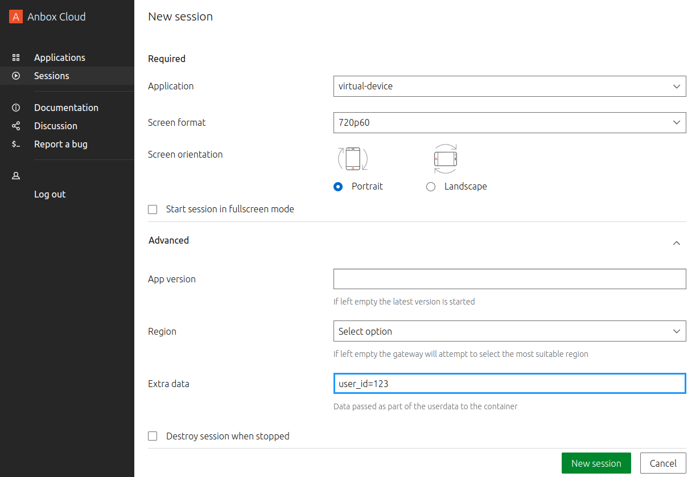

You can pass custom data to your application, which you can then use in addons or hooks. For example, you might want to pass user IDs, application configuration or display settings.

The user data that you pass in is stored in the `/var/lib/anbox/userdata` file in the container, and your hooks can access it from this file.

The structure of the `/var/lib/anbox/userdata` file and the way how you pass in the data depends on whether you pass the data when launching a container or when starting a streaming session.

## Pass custom data when launching a container

When you launch a container, you can pass in custom data through the `--userdata` or the `--userdata-path` flags:

* `--userdata` takes a string and stores the provided data in the `/var/lib/anbox/userdata` file in the container.
* `--userdata-path` takes a file name and copies the contents of the file to the `/var/lib/anbox/userdata` file in the container.

In both cases, the `/var/lib/anbox/userdata` file will contain exactly the data that you provide. The data must be in string form (to send binary data, you must encode it as Base64 text). The size limit for the data is 10 KB.

## Pass custom data when starting a streaming session

When you start a streaming session, you can pass in custom data through the Anbox Stream Gateway:

* When starting the session through the web dashboard, provide your custom data through the "Extra data" field.

  

* When starting the session through the Stream Gateway API, provide your custom data through the `extra_data` field. See [Create session](https://anbox-cloud.github.io/latest/anbox-stream-gateway/#/session/handle-new-session) in the Anbox Stream Gateway documentation.

In both cases, the data is added to the `/var/lib/anbox/userdata` file in JSON format. This file already contains data added by the Stream Gateway for the streaming session. The custom data is available under the `extra_data` field. For example:

```
{
  ...
  "extra_data": "user_id=123"
}
```

To retrieve the data, use a command like `cat /var/lib/anbox/userdata | jq -r .extra_data`, which would return `user_id=123` in the example.
