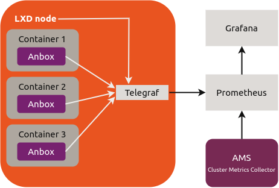

This example implementation provides a starting point for a monitoring stack that can be used to gather metrics with [Telegraf](https://www.influxdata.com/time-series-platform/telegraf/) and [Prometheus](https://prometheus.io/) and access them through [Grafana](https://grafana.com/).

[note type="information" status="Important"]This reference implementation is provided for demonstration purposes only. It does not cover all aspects that you should consider for a production-level solution (for example, high availability).[/note]

In this setup, every LXD cluster node runs a Telegraf instance that gathers the machine metrics. All Anbox containers that exist on the node also report their metrics to the Telegraf instance.

Prometheus gathers the metrics provided by the different sources (the Telegraf instances, AMS, Anbox Stream Gateway and NATS) and stores them in its time series database. You can then access, query and visualise the full metrics data through Grafana.



## Deploy the solution

The monitoring stack is provided as an [overlay file](https://discourse.ubuntu.com/t/installation-customizing/17747#overlay-files) that you use when deploying Anbox Cloud.

The overlay file adds a machine to the deployment (with ID `2` for the `anbox-cloud-core` bundle or ID `3` for the `anbox-cloud` bundle), which is used to run Grafana, Prometheus and HAProxy (as a reverse proxy that secures access to the internal endpoints of the other services). In addition, the overlay installs and configures Telegraf for both AMS and the LXD nodes, and it creates the required relations.

The minimum requirements for the additional machine are as follows:

Architecture   | CPU cores | RAM  | Disk       | GPUs | Components  |
---------------|-----------|------|------------|------|-------------|
amd64          | 4         | 4 GB | 100 GB SSD | no   | Grafana, Prometheus |

Complete the following steps to deploy Anbox Cloud with the reference monitoring stack:

1. Create a `monitoring.yaml` file with the following content, depending on which [Juju bundle](https://discourse.ubuntu.com/t/about-anbox-cloud/17802#juju-bundles) you want to deploy:

   [Details="For the `anbox-cloud-core` bundle"]
   ```yaml
   applications:
     grafana-proxy:
       charm: 'cs:haproxy'
       num_units: 1
       expose: true
       options:
         default_mode: tcp
         peering_mode: active-active
         ssl_cert: SELFSIGNED
         ssl_key: SELFSIGNED
         services: |
           - service_name: app-grafana
             service_host: "0.0.0.0"
             service_port: 443
             service_options:
               - mode http
               - http-request set-path %[path,regsub(^/grafana/?,/)]
               - balance leastconn
             server_options: check verify none inter 2000 rise 2 fall 5 maxconn 4096
             crts: [DEFAULT]
           - service_name: http_service
             service_host: "0.0.0.0"
             service_port: 80
             service_options:
               - mode http
               - http-request redirect scheme https
       to:
         - '2'

     prometheus:
       charm: 'cs:prometheus2'
       num_units: 1
       to:
         - '2'

     ams-monitor:
       charm: 'cs:telegraf'
       options:
         tags: region=cloud-0
         prometheus_output_port: "20003"

     lxd-monitor:
       charm: 'cs:telegraf'
       options:
         tags: region=cloud-0
         prometheus_output_port: "20004"

     grafana:
       charm: 'cs:grafana'
       num_units: 1
       options:
         root_url: '%(protocol)s://%(domain)s:%(http_port)s/grafana'
       to:
         - '2'

   relations:
     - ['ams:prometheus', 'prometheus:scrape']
     - ['grafana:grafana-source', 'prometheus:grafana-source']
     - ['grafana-proxy:reverseproxy', 'grafana:website']
     - ['lxd-monitor:prometheus-client', 'prometheus:target']
     - ['lxd-monitor:juju-info', 'lxd:juju-info']
     - ['ams-monitor:prometheus-client', 'prometheus:target']
     - ['ams-monitor:juju-info', 'ams:juju-info']
     - ['ams:grafana', 'grafana:dashboards']

   machines:
     '0':
       series: focal
       constraints: "cpu-cores=4 mem=8G root-disk=100G"
     '1':
       series: focal
       constraints: "cpu-cores=8 mem=16G root-disk=200G"
     '2':
       series: focal
       constraints: "cpu-cores=4 mem=4G root-disk=100G"
   ```
   [/Details]

   [Details="For the `anbox-cloud` bundle"]
   ```yaml
   applications:
     grafana-proxy:
       charm: 'cs:haproxy'
       num_units: 1
       expose: true
       options:
         default_mode: tcp
         peering_mode: active-active
         ssl_cert: SELFSIGNED
         ssl_key: SELFSIGNED
         services: |
           - service_name: app-grafana
             service_host: "0.0.0.0"
             service_port: 443
             service_options:
               - mode http
               - http-request set-path %[path,regsub(^/grafana/?,/)]
               - balance leastconn
             server_options: check verify none inter 2000 rise 2 fall 5 maxconn 4096
             crts: [DEFAULT]
           - service_name: http_service
             service_host: "0.0.0.0"
             service_port: 80
             service_options:
               - mode http
               - http-request redirect scheme https
       to:
         - '3'

     prometheus:
       charm: 'cs:prometheus2'
       num_units: 1
       to:
         - '3'

     ams-monitor:
       charm: 'cs:telegraf'
       options:
         tags: region=cloud-0
         prometheus_output_port: "20003"

     lxd-monitor:
       charm: 'cs:telegraf'
       options:
         tags: region=cloud-0
         prometheus_output_port: "20004"

     grafana:
       charm: 'cs:grafana'
       num_units: 1
       options:
         root_url: '%(protocol)s://%(domain)s:%(http_port)s/grafana'
       to:
         - '3'

   relations:
     - ['ams:prometheus', 'prometheus:scrape']
     - ['grafana:grafana-source', 'prometheus:grafana-source']
     - ['grafana-proxy:reverseproxy', 'grafana:website']
     - ['lxd-monitor:prometheus-client', 'prometheus:target']
     - ['lxd-monitor:juju-info', 'lxd:juju-info']
     - ['ams-monitor:prometheus-client', 'prometheus:target']
     - ['ams-monitor:juju-info', 'ams:juju-info']
     - ['ams:grafana', 'grafana:dashboards']
     - ['anbox-stream-gateway:prometheus', 'prometheus:scrape']
     - ['anbox-stream-gateway:grafana', 'grafana:dashboards']

   machines:
     '0':
       series: focal
       constraints: "cpu-cores=4 mem=4G root-disk=100G"
     '1':
       series: focal
       constraints: "cpu-cores=4 mem=8G root-disk=100G"
     '2':
       series: focal
       constraints: "cpu-cores=8 mem=16G root-disk=200G"
     '3':
       series: focal
       constraints: "cpu-cores=4 mem=4G root-disk=100G"
   ```
   [/Details]

   [note type="information" status="Note"]For a production-level solution, replace the automatically generated self-signed SSL credentials with proper ones.[/note]
1. Deploy Anbox Cloud with the overlay file.

   - For the `anbox-cloud-core` bundle:

         juju deploy cs:~anbox-charmers/anbox-cloud-core --overlay monitoring.yaml

   - For the `anbox-cloud` bundle:

         juju deploy cs:~anbox-charmers/anbox-cloud --overlay monitoring.yaml

   [note type="information" status="Note"]You can use the same command if you already deployed Anbox Cloud. In this case, Juju checks the existing deployment and only deploys new components.[/note]
1. Wait until all added units are in `active` state.

## Access Grafana

To access the metrics in Grafana, go to `https://<IP_address>/grafana` in your browser.

Replace `<IP_address>` with the IP address of the machine on which you deployed the `grafana-proxy` application. If you don't know the address, run `juju status` to display the information for all machines.

You must enter your user name and password to log in. The user name is `admin`. You can determine the password by running the following command:

    juju run-action --wait grafana/0 get-admin-password

[note type="information" status="Note"]If you have deployed more than one Grafana unit, you might need to replace the `0` in `grafana/0` with the suitable unit ID. Check `juju status` if you are in doubt.[/note]

The response should look similar to this:

```yaml
unit-grafana-0:
  id: 29f07367-556b-41d0-8318-b9fa13a78b63
  results:
    password: jd673zyYWkR7kyPW
  status: completed
  timing:
    completed: 2018-06-29 13:29:38 +0000 UTC
    enqueued: 2018-06-29 13:29:36 +0000 UTC
    started: 2018-06-29 13:29:38 +0000 UTC
  unit: grafana/0
```

In this example output, the password is `jd673zyYWkR7kyPW`.
